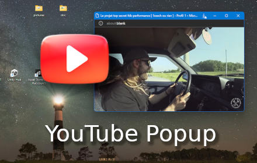

#  YouTube Popup
___

## An extension to open YouTube videos in a **popup window**

> Open the YouTube web site on a video, and then click on the extension button  If you are currently over a **youtube/watch** browser tab this extension will open the video in a new **popup window**.

 
<i>watching FDB on YouTube over the desktop (Edge, Windows 11)</i>

 
 

If the current browser is not a **YouTube™** video watching page, an **alert popup** will be displayed:

 
<i>not a YoutTube web page</i>

 

> You might setup the popup to fly over all other windows (topmost) for more convenience, so you can go back to your work and still watch the video. For that you can use one of the several OS specific software that allows it. On Windows you could try :
>> Window TopMost Control (just press CTRL+ALT+SPACE and the current windows becomes topmost) [download here](https://www.sordum.org/9182/window-topmost-control-v1-2/), Microsoft PowerToys, PinWin, PinWin – Pin On Top, TurboTop, OnTopReplica, DeskPins, AOT Extension for Chrome & Firefox, WindowTop, OnTopper, TopMostFriend, PinMe, ...

## About

- Author: Franck Gaspoz  
> [contact me (mail)](mailto:franck.gaspoz@gmail.com) 
[visit the project homepage](https://github.com/franck-gaspoz) @ **[https://github.com/franck-gaspoz/youtube-popup](https://github.com/franck-gaspoz/youtube-popup)**

thanks to: 
- <a target="_blank" href="https://icons8.com/icon/1CFLY7AQOCRy/manual">Manual</a> icon by <a target="_blank" href="https://icons8.com">Icons8</a>
- <a target="_blank" href="https://icons8.com/icon/qLVB1tIe9Ts9/youtube">YouTube</a> icon by <a target="_blank" href="https://icons8.com">Icons8</a> 

### Assets

 <i>marquee (medium size)</i>

 

 <i>promote (small size)</i>

### Links

- sources can be found in GitHub repository: [https://github.com/franck-gaspoz/youtube-popup](https://github.com/franck-gaspoz/youtube-popup)

### History

- 8/7/2023 1.0.0
 first release

